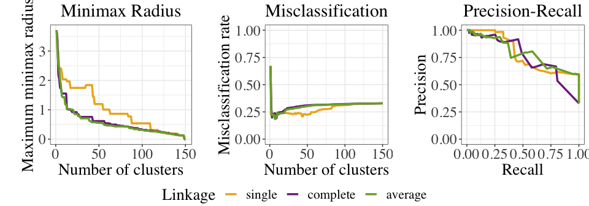
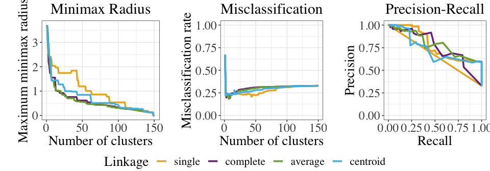

<!-- README.md is generated from README.Rmd. Please edit that file -->

# clusterTruster

This is a package to benchmark linkages in hierarchical clustering.
Please see our paper on arXiv for more detailed examples:
<https://arxiv.org/abs/1906.03336>. The authors of the paper and this
package are Xiao Hui Tai (<https://xhtai.github.io/>) and Kayla Frisoli
(<http://stat.cmu.edu/~kfrisoli/>).

## Installation

You can install `clusterTruster` from GitHub with:

``` r
devtools::install_github("xhtai/clusterTruster", build_vignettes = TRUE)
library(clusterTruster)
```

## Reproducing paper results

The package contains a vignette with code to reproduce the results in
our paper. To view the vignette, you would have had to install the
package with the option `build_vignettes = TRUE`. You can then view the
vignette using

``` r
vignette("reproducePaperResults", package = "clusterTruster")
```

## Examples

### iris

We can analyze the iris data set as follows. We first center and scale
the four features, “Sepal.Length”, “Sepal.Width”, “Petal.Length”,
“Petal.Width”, and generate the l2 distance between all pairs. We then
use various linkage methods to generate all associated evaluation
metrics.

``` r
myPairwise <- clusterTruster::genPairwise(iris, 5)
iris[, 1:4] <- scale(iris[, 1:4])
myPairwise <-
  clusterTruster::genSimDiff(iris, 1:4, myPairwise, 1:2, "l2dist")
```

Note that the following code could take a while to run.

``` r
outMetrics_iris_single <- clusterTruster::getMetrics(
  myPairwise,
  pairColNums = 1:2,
  matchColNum = 3,
  distSimCol = "l2dist",
  linkage = "single"
)
outMetrics_iris_complete <- clusterTruster::getMetrics(
  myPairwise,
  pairColNums = 1:2,
  matchColNum = 3,
  distSimCol = "l2dist",
  linkage = "complete"
)
outMetrics_iris_average <- clusterTruster::getMetrics(
  myPairwise,
  pairColNums = 1:2,
  matchColNum = 3,
  distSimCol = "l2dist",
  linkage = "average"
)
outMetrics_iris_centroid <- clusterTruster::getMetrics(
  myPairwise,
  pairColNums = 1:2,
  matchColNum = 3,
  distSimCol = "l2dist",
  linkage = "centroid"
)
outMetrics_iris_minimax <- clusterTruster::getMetrics(
  myPairwise,
  pairColNums = 1:2,
  matchColNum = 3,
  distSimCol = "l2dist",
  linkage = "minimax"
)
```

#### Plotting linkage method results for iris

To compare single, complete, and average:

``` r
clusterTruster::plotResultsGG_base(
  single = outMetrics_iris_single,
  complete = outMetrics_iris_complete,
  average = outMetrics_iris_average,
  correlation = FALSE,
  write_plot = FALSE,
  plot_type = c("all", "minimax", "misclass", "pr")
)
```



To compare all:

``` r
clusterTruster::plotResultsGG_base(
  single = outMetrics_iris_single,
  complete = outMetrics_iris_complete,
  average = outMetrics_iris_average,
  centroid = outMetrics_iris_centroid,
  minimax = outMetrics_iris_minimax,
  correlation = FALSE,
  write_plot = FALSE,
  plot_type = c("all", "minimax", "misclass", "pr")
)
```



## License

The `clusterTruster` package is licensed under GPLv3
(<http://www.gnu.org/licenses/gpl.html>).
